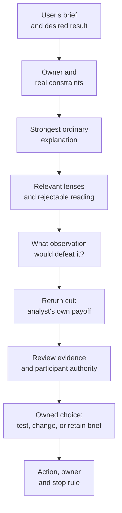
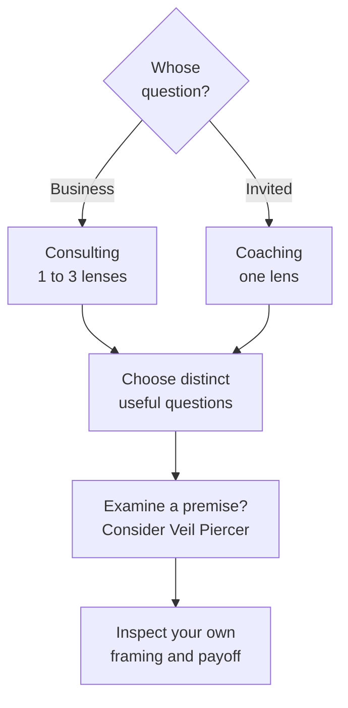
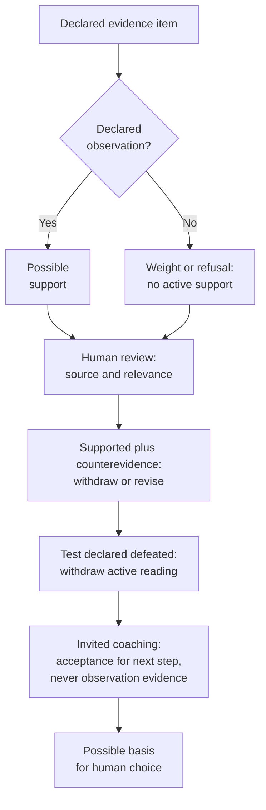
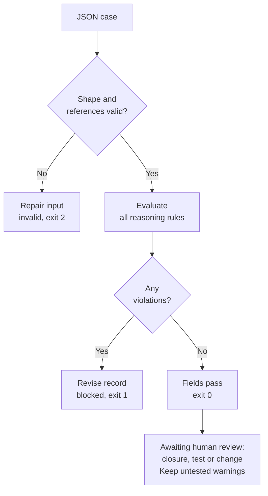
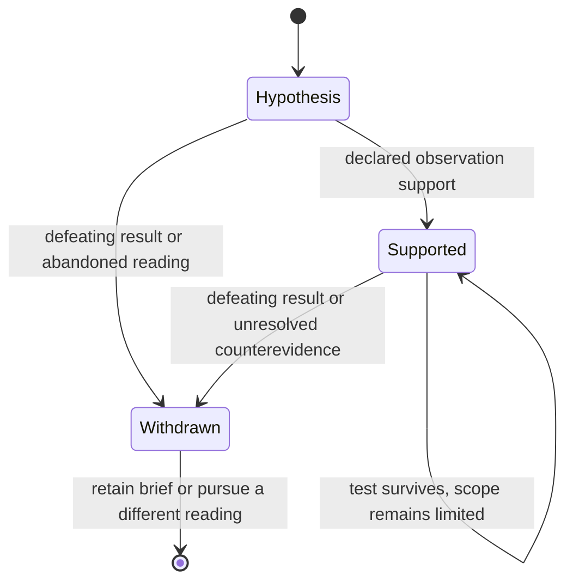
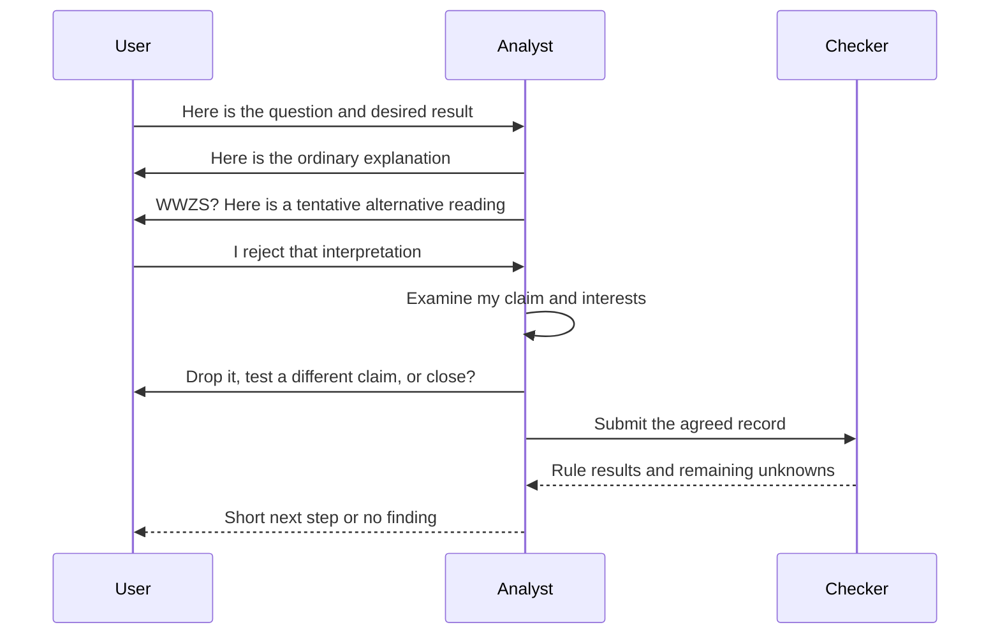
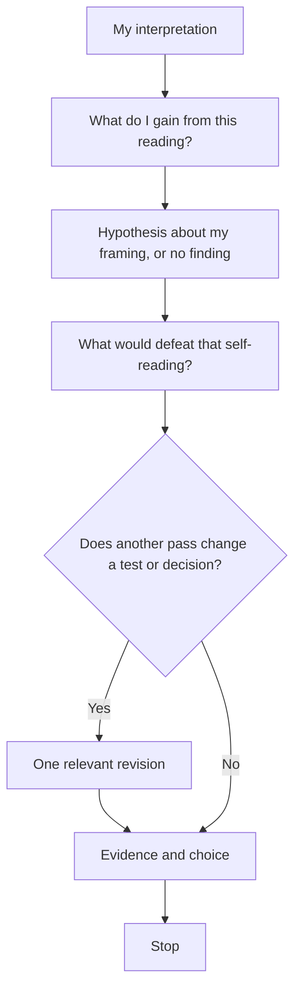
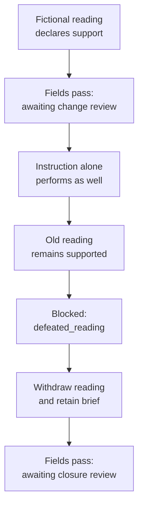
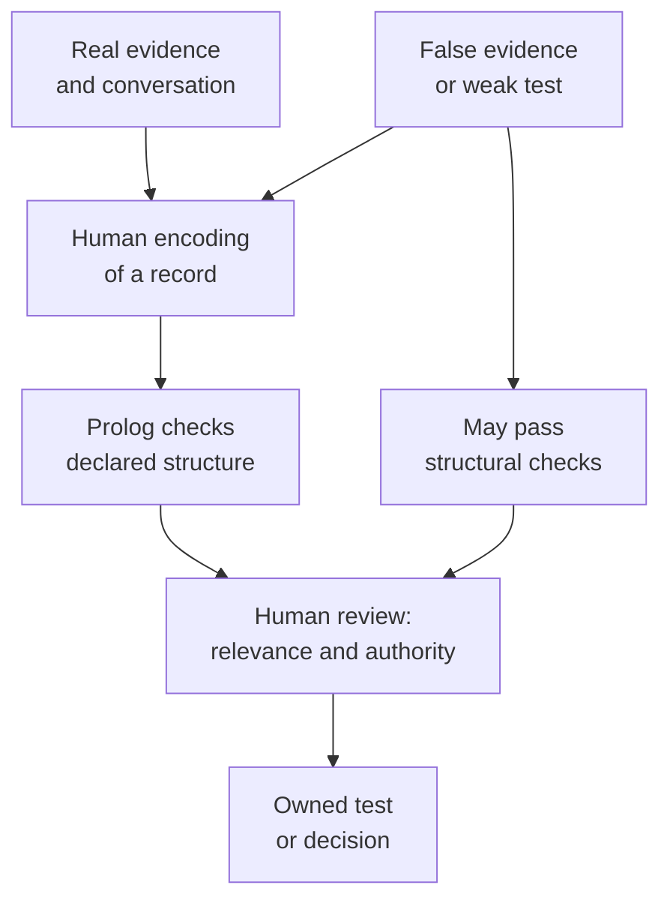

# The Zizkian: a field guide

**One word: refutable.** A reading must be able to lose its place in the decision.

The Zizkian asks what a brief takes for granted, tests an interpretation against an ordinary explanation, and includes the analyst in the critique. **WWZS?** is the provocation mode, not a claim to know what Žižek would say. The inherited question, **“What would prove that reading wrong?”**, supplies the exit from a compelling story. This guide makes the workflow inspectable and gives you records that you can run, alter and reject.

Companion [essay](essay.md), [method](method.md), [evaluation plan](evaluation.md) and [licensing polemic](licensing-polemic.md).

The diagrams describe the intended workflow and the implemented checker where explicitly named. They do not describe an automatic dispatcher integration. All worked evidence and participant statements below are fictional.

## 1. The map: question to choice



No finding is an ordinary destination. A quiet conclusion is not an invitation to invent another veil.

## 2. Selection: lenses earn their place



The complete [consulting](../prompts/consulting.md) and [coaching](../prompts/coaching.md) libraries name the available lenses. These branches are choices, not a requirement to activate every lens. One business lens may suffice. The numeric attention matrix remains conceptual and excluded from decision authority.

## 3. Evidence: what can support what?



The program checks IDs, declared kinds and relationships. It cannot establish that an observation is genuine or relevant. In particular, a sentence marked `observation` is not automatically evidence of a hidden motive.

## 4. The executable gate



`pass` means the supplied record satisfies the encoded rules. It does not certify a recommendation, source, consent, causal explanation or model output.

## 5. A reading can change state



This is the intended epistemic lifecycle. The checker audits a snapshot; it does not automatically promote, withdraw or rewrite a reading. A revised claim gets its own record, evidence and defeating test rather than silently erasing the failed claim.

## 6. WWZS? without an interpretation trap



Rejecting an interpretation does not prove it false in every setting. It does prevent the analyst from treating the refusal as evidence of resistance, and it prevents the rejected framing from driving the participant's next step in this checker.

## 7. The return cut has an exit



The return cut is directed at the analyst's own framing. Self-awareness is not evidence for the original claim, and recursion does not have to become an endless conversation.

## 8. The first proof: a Zizkian reading is refutable

The proof obligation is deliberately narrow:

```text
There exists a declared case C and reading r such that:
  audit(C) passes;
  adding r's defeating observation while retaining r blocks C';
  withdrawing r and closing the inquiry allows C'' to pass.
```

This is a finite witness of a property of our encoded method. It is not proof that the fictional diagnosis is true, that every prose interpretation is empirically falsifiable, or that the toolkit improves decisions.



The decisive Prolog rule is:

```prolog
violation(C, defeated_reading, Target, 'A defeated reading must be withdrawn.') :-
    member(R, C.readings), Target = R.id,
    active(R), R.defeat_test.status == defeated.
```

The premises are explicit: a valid record contains an active reading and declares its defeating test observed. Prolog derives a violation from those premises. The checker neither observes the world nor invents the defeating result.

Run the witness from the repo root:

```sh
swipl -q -s proof/refutable.pl
```

It loads `supported.json`, `defeated.json` and `withdrawn.json`, checks the required outcomes and prints the three reports. The `defeated_reading` rule appears in the middle report; the last report returns `awaiting_closure_review`.

## 9. Usage: begin with an honest unknown

A team asks for a longer onboarding tutorial. You suspect that flow complexity is the problem. You have not observed users, so the suspicion stays a hypothesis. Select Constraint Hunter and Veil Piercer, consider that ordinary instruction might work, and specify a comparison before recommending a redesign.

```sh
swipl -q -s src/check.pl -- examples/hypothesis.json
```

Expected: `pass`, `awaiting_test_review`, with warnings for the untested ordinary explanation and falsifier. This licenses no claim that the redesign is necessary. The next step is to obtain evidence.

The fictional `supported.json` later supplies a declared observation and a check of ordinary instruction. It passes as `awaiting_change_review`. Human review must still decide whether that observation supports the claimed mechanism and whether the proposed action is proportionate.

## 10. Usage: accept an ordinary answer

The instruction works; there is no supported reason to reframe the task. Use Operator, or close the selected inquiry. Return “keep the instruction” rather than inventing a hidden institutional interest.

```sh
swipl -q -s src/check.pl -- examples/no-finding.json
```

Expected: `pass`, `awaiting_closure_review`. No readings are required to fill a format.

## 11. Usage: refuse a coaching trap

A person says delegation is blocked by staffing. A coach interprets this as a desire to remain indispensable. The person objects. The coach treats the objection as support and prescribes an exercise based on that refused framing.

```sh
swipl -q -s src/check.pl -- examples/rejection-trap.json
```

Expected: `blocked`. The record has no observation support, uses rejection as evidence, and drives a next step with the refused framing. Removing the objection from the transcript or renaming it an observation is not a repair. Return to the person's stated question, examine staffing, and invite a different exploration only if they want it.

## 12. Exercises: make the operator earn its place

Work on copies under `work/exercises/`; keep the supplied examples intact. You can use a text editor and the CLI above. Run the copied record after each change. Answers are below, so stop before the answer key if you want the exercise first.

1. **Refute it.** Start with `supported.json`. Add observation `e2`: instruction alone performs as well as a simpler flow. Mark `r1.defeat_test` defeated and point its evidence to `e2`, while leaving `r1` supported. Predict the verdict and the exact rule before running it.
2. **Withdraw without rewriting history.** Repair exercise 1 while preserving both observation records and the failed claim. What outcome allows closure? Which field must become empty?
3. **Find the ordinary explanation.** Start with `hypothesis.json`. Write a plausible ordinary alternative that would make a redesign unnecessary. Write a comparison that could distinguish it from flow complexity. Keep both checks untested; do not manufacture evidence to remove warnings.
4. **Catch numerical authority.** In a copy of `supported.json`, change its only supporting item's kind to `attention_weight`. Predict whether a high number or the framework's name should rescue the reading. Run the checker.
5. **Hear no.** Inspect `rejection-trap.json`. Identify each rule it violates. Draft a one-sentence response to the participant that respects their correction. Produce a `retain_brief` record with the motive claim withdrawn and no selected reading; do not record a commitment they did not make.
6. **Cut the critic.** Write your own analyst return cut: what do you gain by preferring the deeper reading? Add a concrete observation that would defeat that self-reading. “I might be biased” is not a defeating observation. A no-finding result is permitted.
7. **Expose a checker loophole.** Label an irrelevant or fabricated statement `observation`, give it a nonblank source and reference it as support. Can the record pass? Explain why passage is insufficient, and write the human review question that catches it. Keep the fabricated record explicitly labelled as an exercise.
8. **Earn a lens.** Pick a real question you are authorized to examine. Record the desired result, owner and strongest ordinary explanation. Select one lens. Add another only if you can name a different test or decision it contributes. If the questions change neither evidence nor action, close the inquiry.
9. **Keep disagreement.** Give a supported reading counterevidence under a new ID. Predict `unresolved_counterevidence`. Do not average the two statements or delete the inconvenient one. Withdraw the overbroad reading; propose a narrower, explicitly hypothetical claim with a new ID and test.
10. **Compare with a plain checklist.** Write a plain version using only question, evidence, alternative, owner and next step. Apply both versions to the same authorized case without showing the branding to a reviewer. Record unsupported claims, concrete tests, chosen actions and time spent. A more memorable explanation alone does not count as improved performance.

## 13. Answer key and completion criteria

| Exercise | Expected result or criterion |
|---|---|
| 1 | `blocked`; `defeated_reading` appears even if old support remains |
| 2 | Mark `r1` withdrawn; use `retain_brief`; clear `outcome.reading_ids`; expected `pass / awaiting_closure_review` |
| 3 | `pass / awaiting_test_review`; warnings stay until observations are actually recorded |
| 4 | `blocked`; `weight_as_evidence` and `unsupported_reading`; if used by a completed test or ordinary check, those also lack observation evidence |
| 5 | At least `unsupported_reading`, `rejection_as_evidence`, `participant_rejected`, `coaching_choice_unconfirmed`; a withdrawn claim with no selected reading can close |
| 6 | Named observer, specific possible payoff and a defeating observation; the quality of the prose needs human review |
| 7 | Structurally well-formed false or irrelevant evidence can pass; ask whether the source exists, was read and actually supports the claim |
| 8 | The chosen lens contributes a distinct question that could affect the result; one lens or no finding is enough |
| 9 | The original supported reading is blocked; a narrower hypothesis may support a test, never a declared decision change without observations |
| 10 | A comparison record, including disappointing or null results; no claims of superiority from this single exercise |

An exercise succeeds when you can say what you know, what you are assuming, what would change your reading and who owns the next step. Agreement with the analyst is not the goal.

## 14. What the checker cannot protect you from



An interpretation can be leading while every field is filled. A source can be imaginary. A test can be weak. Consent can be misreported. The checker makes selected contradictions and omissions visible; it has no privileged access to motives or truth. The experimental value of the whole toolkit over an ordinary checklist remains unknown [1 SPECULATIVE \| no comparative outcome evidence].

Use the guide as an inquiry and review aid [1 SPECULATIVE \| design proposal]. If that use is wrong, the earliest signal is more time and more compelling explanations with no better evidence, no changed test and no participant-owned action. Keep the result that survives; retire the machinery that does not.

Implementation: [checker contract](checker.md). The executable examples use SWI-Prolog's [JSON dict interface](https://www.swi-prolog.org/pldoc/man?section=json) and [PlUnit](https://www.swi-prolog.org/pldoc/doc_for?object=section('packages/plunit.html')).
